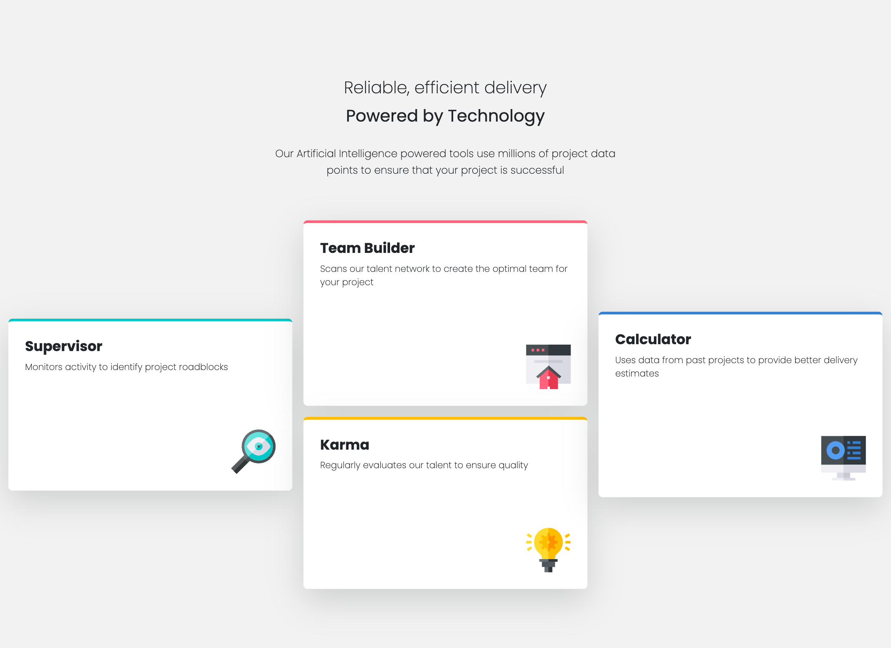
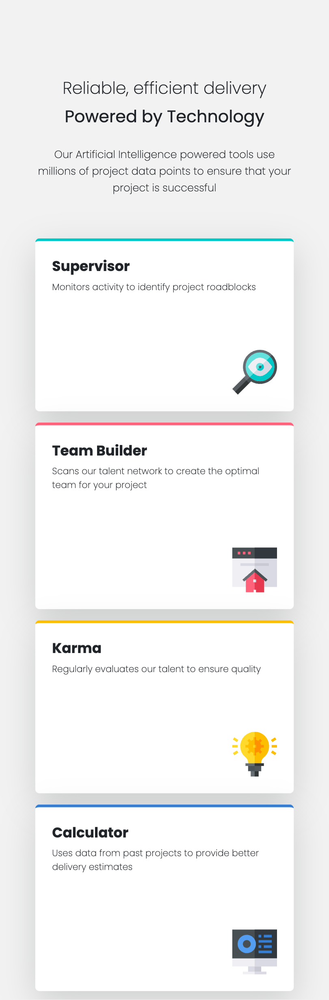

# Frontend Mentor - Four card feature section solution

This is a solution to the [Four card feature section challenge on Frontend Mentor](https://www.frontendmentor.io/challenges/four-card-feature-section-weK1eFYK). Frontend Mentor challenges help you improve your coding skills by building realistic projects. 

## Table of contents

- [Overview](#overview)
  - [The challenge](#the-challenge)
  - [Screenshot](#screenshot)
  - [Links](#links)
- [My process](#my-process)
  - [Built with](#built-with)
  - [What I learned](#what-i-learned)
- [Author](#author)


## Overview

### The challenge

Users should be able to:

- View the optimal layout for the site depending on their device's screen size

### Screenshot

## Desktop


## Mobile


### Links

- Solution URL: [https://github.com/filecc/FM-four-card-feature-section](https://github.com/filecc/FM-four-card-feature-section)
- Live Site URL: [https://filecc.github.io/FM-four-card-feature-section/](https://filecc.github.io/FM-four-card-feature-section/)

## My process

### Built with

- Semantic HTML5 markup
- CSS custom properties
- Mobile-first workflow
- [Tailwind CSS](https://tailwindcss.com/) - CSS Framework (style)
- [Bootstrap](https://getbootstrap.com/) - CSS framework (layout)

### What I learned

Fun time using Bootstrap (for layout Grid) and Tailwind (for endless styling with no CSS code)

To see how you can add code snippets, see below:

```html
    <header>
      <div class="container pt-28 text-center">
        <div class="row justify-content-center align-items-center">
          <div class="col-10 col-lg-5">
            <h1 class="text-[24px] font-extralight">
              Reliable, efficient delivery
            </h1>
            <p class="pt-2 text-[24px]">Powered by Technology</p>
            <p class="pt-6 pb-12 text-[15px] font-extralight leading-6">
              Our Artificial Intelligence powered tools use millions of project
              data points to ensure that your project is successful
            </p>
          </div>
        </div>
      </div>
    </header>
```

## Author

- Website - [Instagram](https://www.instagram.com/filecc)
- Frontend Mentor - [@filecc](https://www.frontendmentor.io/profile/filecc)
- Twitter - [@_filecc](https://www.twitter.com/_filecc)
